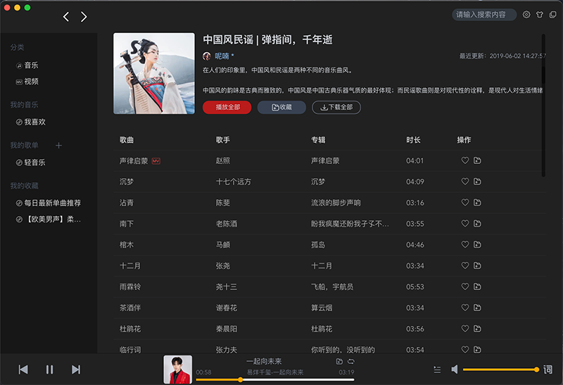

# TIMP音乐聚合平台

TIMP音乐聚合平台是一个聚合多个平台的桌面音乐播放软件，fork了vite-electron-builder仓库作为项目框架，项目采用vue3 + vite + electron + windicss进行开发，数据来源于github开源项目.

- 网易云音乐: [网易云音乐API](https://github.com/Binaryify/NeteaseCloudMusicApi)
- QQ音乐API: [QQ音乐API](https://github.com/Rain120/qq-music-api)
- 酷狗音乐API: [酷狗音乐API](https://github.com/H-Haynes/kuwoMusicApi)
- 酷我音乐API: [酷我与酷狗同项目](https://github.com/H-Haynes/kuwoMusicApi)

## 项目开发运行环境

[](https://nodejs.org/about/releases/)
[](https://github.com/npm/cli/releases)

## 设置环境变量

所有环境变量均在`import.meta`,你可以使用`import.meta.env`进行访问

如果使用`Typescript`，你需要在`types/env.d.ts`文件中添加所有环境变量到`importMetaEnv`

`mode`设置应在`import.meta.env.MODE`设置一个特殊值，环境变量文件加载时，该变量会被解析

默认情况下，有两种模式：

- `production`, 默认使用该值
- `development`，当使用`npm run watch`时，使用该值

当使用build命令时，从根目录的对一个的env环境加载环境变量:

```yml
.env                # 所有环境都会加载
.env.local          # 所有环境都会加载，但git提交时会被忽略
.env.[mode]         # 仅在对应mode时才会加载
.env.[mode].local   # 仅在对应mode时才会加载，git提交时会被忽略
```

## 开发命令

- `npm run app:dev` : 本地开发并开启热更新
- `npm run compile`: 编译为桌面应用程序
- `npm run build` : 项目打包
- `npm run test` : 本地测试
- `npm run dist --平台 --架构`: 打包为对应系统安装包程序

## mac logo生成

```shell
mkdir fan.iconset
sips -z 16 16     ~/logo.png --out fan.iconset/icon_16x16.png
sips -z 32 32     ~/logo.png --out fan.iconset/icon_16x16@2x.png
sips -z 32 32     ~/logo.png --out fan.iconset/icon_32x32.png
sips -z 64 64     ~/logo.png --out fan.iconset/icon_32x32@2x.png
sips -z 64 64     ~/logo.png --out fan.iconset/icon_64x64.png
sips -z 128 128     ~/logo.png --out fan.iconset/icon_64x64@2x.png
sips -z 128 128   ~/logo.png --out fan.iconset/icon_128x128.png
sips -z 256 256   ~/logo.png --out fan.iconset/icon_128x128@2x.png
sips -z 256 256   ~/logo.png --out fan.iconset/icon_256x256.png
sips -z 512 512   ~/logo.png --out fan.iconset/icon_256x256@2x.png
sips -z 512 512   ~/logo.png --out fan.iconset/icon_512x512.png
sips -z 1024 1024   ~/logo.png --out fan.iconset/icon_512x512@2x.png
sips -z 1024 1024   ~/logo.png --out fan.iconset/icon_1024x1024.png
iconutil -c icns fan.iconset -o logo.icns
```

## 应用程序功能展示





